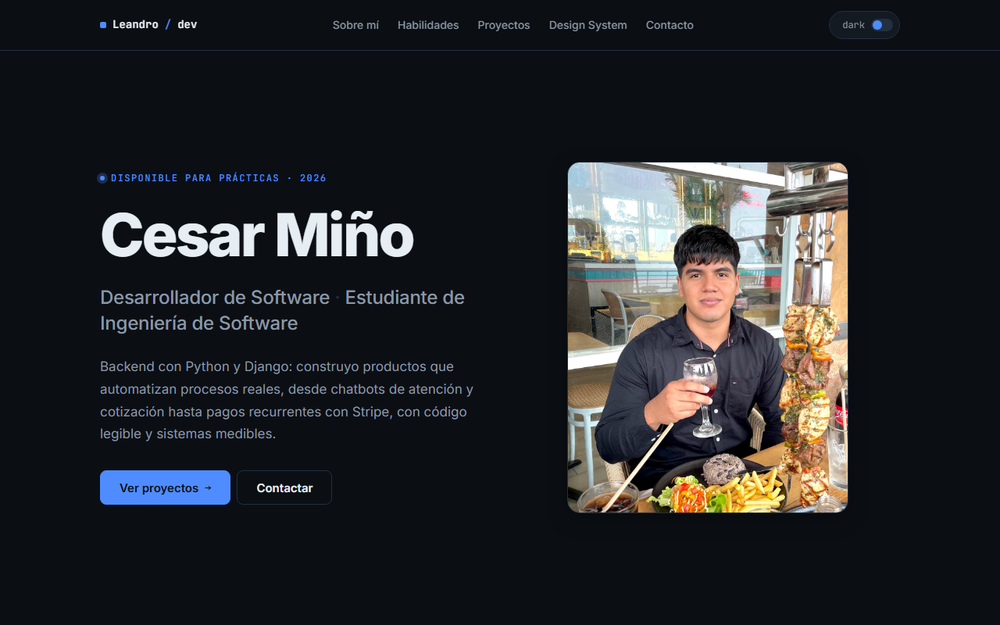
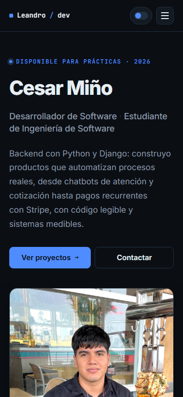

# Portafolio web — Leandro

Portafolio personal de una sola página de Leandro, desarrollador de software (backend) y estudiante de octavo semestre de Ingeniería de Software. Construido con HTML semántico, CSS con variables y JavaScript vanilla, sin frameworks ni build, listo para GitHub Pages.

**Sitio publicado:** https://[GITHUB_USER].github.io/portafolio/

## Capturas

| Escritorio (oscuro) | Móvil | Tema claro |
|---|---|---|
|  |  |  |

> Las capturas son placeholders: guarda tus imágenes en `assets/img/` con esos nombres.

## Tecnologías

- **HTML5 semántico**: `header`, `nav`, `main`, `section`, `article`, `figure`, `footer`; un solo `h1`, jerarquía h1 → h2 → h3; formularios con `label` asociado.
- **CSS3**: custom properties (design tokens en `css/variables.css`), Flexbox, Grid, `clamp()`, media queries, `prefers-reduced-motion`, tema claro/oscuro solo redefiniendo variables.
- **JavaScript vanilla** (ES5/ES6 sin módulos): render desde datos, filtro, modal accesible, validación de formulario, tema persistente en `localStorage`.
- **Tipografías**: Inter y JetBrains Mono desde Google Fonts.
- **Git + GitHub Pages** para versionado y publicación.

## Estructura

```
portafolio/
├── index.html
├── css/
│   ├── variables.css   # tokens (:root y :root[data-theme="light"])
│   └── styles.css      # base, layout, componentes, responsive (comentado por secciones)
├── js/
│   ├── data.js         # contenido: proyectos, skills, paleta, espaciado (window.PORTFOLIO_DATA)
│   ├── icons.js        # GENERADO: logos SVG en línea (node scripts/build-icons.js)
│   ├── theme.js        # tema claro/oscuro + localStorage
│   ├── nav.js          # menú hamburguesa, volver arriba
│   ├── projects.js     # tarjetas, filtro por tecnología, modal
│   ├── contact.js      # validación y confirmación del formulario
│   └── main.js         # inicialización y render de skills/design system
├── assets/img/         # foto y capturas
├── assets/icons/       # logos SVG monocromos de las habilidades (Simple Icons, CC0)
├── scripts/build-icons.js  # genera js/icons.js desde assets/icons/
├── README.md
└── .gitignore
```

## Secciones

1. **Inicio**: nombre, rol, descripción, foto 4:5 y botones de acción.
2. **Sobre mí**: descripción y métricas (proyectos, semestre, ciudad).
3. **Habilidades**: grupos Frontend, Backend, Bases de datos, Herramientas, Cloud y Diseño con barra de nivel.
4. **Proyectos**: tarjetas generadas desde `js/data.js`, filtro por tecnología y modal de detalle.
5. **Design System**: paleta, tipografía, espaciado, radios, sombra y componentes reales del sitio.
6. **Contacto**: correo, GitHub y formulario con validación y confirmación en pantalla.

## Funcionalidades JavaScript

- Tema claro/oscuro persistente (`localStorage['portafolio-theme']`, atributo `data-theme` en `<html>`).
- Menú hamburguesa en móvil (cierra con enlace, Escape o clic fuera).
- Render de proyectos y habilidades desde `js/data.js`.
- Filtro de proyectos por tecnología con mensaje "sin resultados".
- Modal de proyecto: cierre por botón, clic fuera y Escape; foco atrapado y devuelto al cerrar.
- Validación del formulario: nombre obligatorio, correo con expresión regular, mensaje mínimo 10 caracteres; errores por campo.
- Al enviar con datos válidos, el formulario muestra "✓ Mensaje enviado" y limpia los campos (sin llamadas a servicios externos).
- Botón "volver arriba" tras 480px de scroll con desplazamiento suave.

## Cómo verlo en local

No requiere instalación. Dos opciones:

1. Doble clic en `index.html` (funciona con `file://` porque no usa módulos ES).
2. Con un servidor estático, por ejemplo:

```bash
# Python 3
python -m http.server 8080
# o con Node
npx serve .
```

y abre http://localhost:8080.

## Publicar en GitHub Pages

1. Crea un repositorio público en GitHub llamado `portafolio` (sin README ni .gitignore, ya existen).
2. Conecta y sube el código:

```bash
git remote add origin https://github.com/[GITHUB_USER]/portafolio.git
git push -u origin main
```

3. En el repositorio: **Settings → Pages → Build and deployment**:
   - Source: *Deploy from a branch*
   - Branch: `main` · Folder: `/ (root)` → **Save**
4. En uno o dos minutos el sitio queda en `https://[GITHUB_USER].github.io/portafolio/`.

Si tienes GitHub CLI instalado, los pasos 1 y 2 se reducen a:

```bash
gh repo create portafolio --public --source=. --remote=origin --push
```

## Formulario de contacto

El formulario valida en el cliente (nombre obligatorio, correo con formato válido, mensaje de al menos 10 caracteres) y, si todo es correcto, muestra "✓ Mensaje enviado" y limpia los campos. No envía datos a ningún servicio; el contacto real es por correo.

## Placeholders a reemplazar

| Placeholder | Dónde |
|---|---|
| Foto del hero | Ya incluida en `assets/img/hero.jpg` (`` en el hero); para cambiarla, reemplaza el archivo |
| `[GITHUB_USER]` | este README (URL del sitio y remoto) |

## Licencia

Uso personal y académico.
